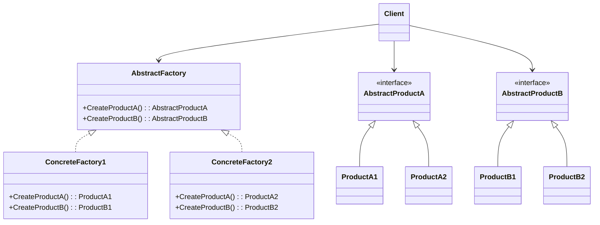

This line is from `content/firstpost.md`.

[Go to home](/)

## Class Diagram with ` +CreateProductA() : ProductA1`

```mermaid
classDiagram
    AbstractFactory <|.. ConcreteFactory1
    AbstractFactory <|.. ConcreteFactory2

    AbstractProductA <|-- ProductA1
    AbstractProductA <|-- ProductA2
    AbstractProductB <|-- ProductB1
    AbstractProductB <|-- ProductB2

    Client --> AbstractFactory
    Client --> AbstractProductA
    Client --> AbstractProductB

    class AbstractFactory {
        +CreateProductA() : AbstractProductA
        +CreateProductB() : AbstractProductB
    }

    class ConcreteFactory1 {
        +CreateProductA() : ProductA1
        +CreateProductB() : ProductB1
    }

    class ConcreteFactory2 {
        +CreateProductA() : ProductA2
        +CreateProductB() : ProductB2
    }

    class AbstractProductA {
        <<interface>>
    }

    class AbstractProductB {
        <<interface>>
    }

    class ProductA1
    class ProductA2
    class ProductB1
    class ProductB2
```